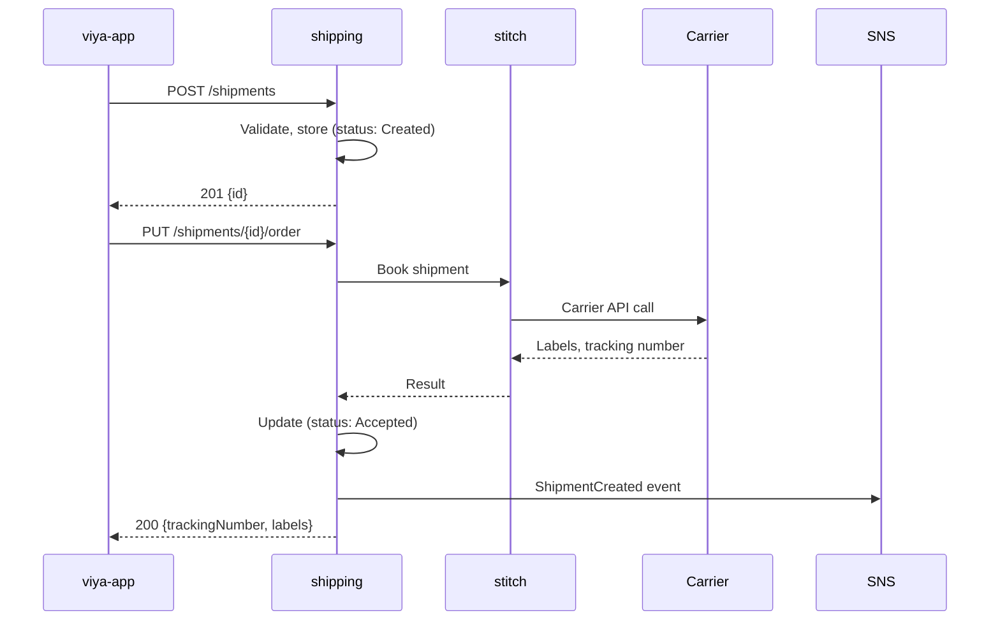
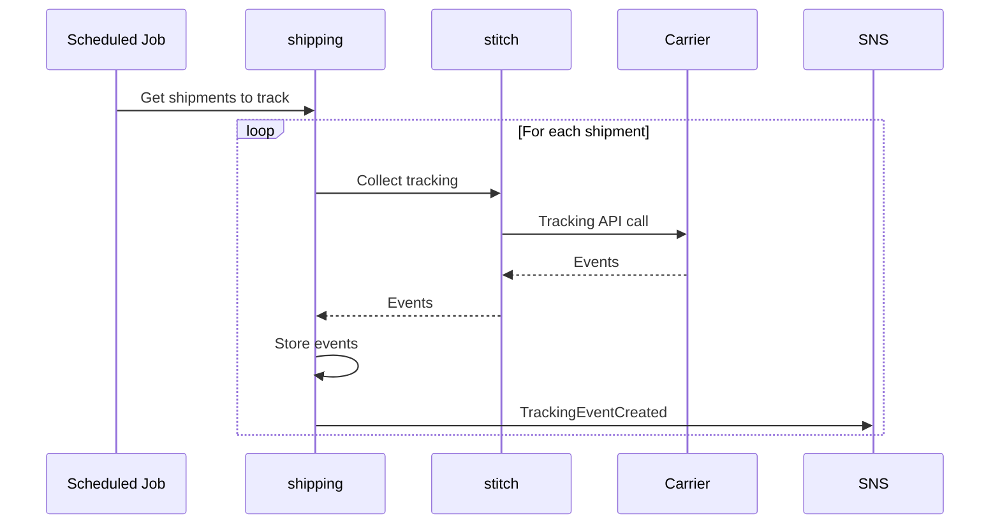
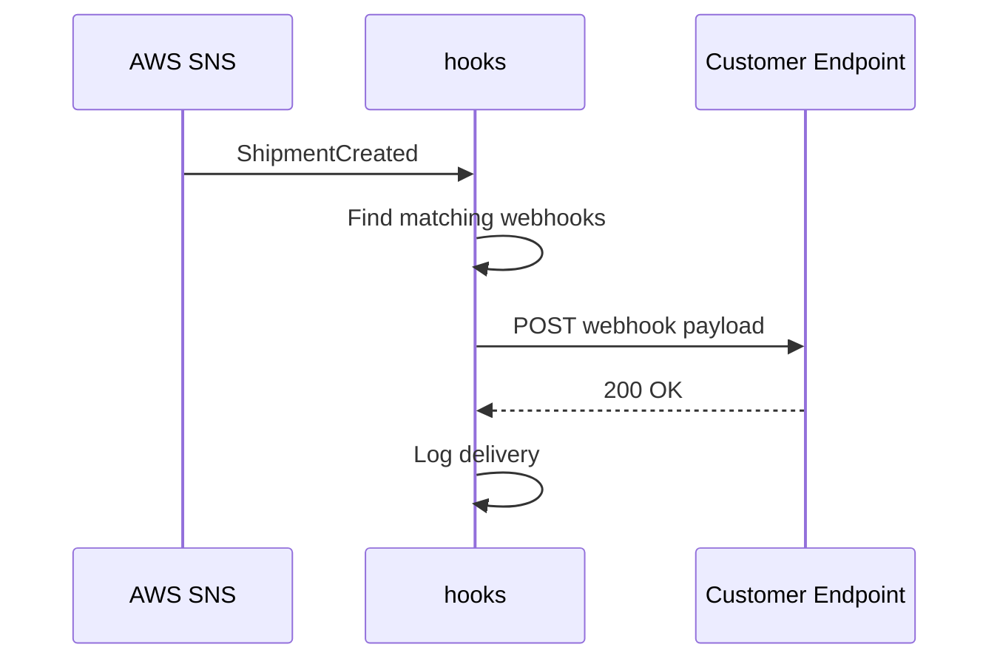

# System Overview

Viya is a cloud-based Transportation Management System (TMS) for B2B shippers.

## System Boundaries

```
┌─────────────────────────────────────────────────────────────────────────────┐
│                              EXTERNAL USERS                                  │
│  Shippers (Web UI) │ Carriers (Portal) │ API Integrations (M2M)             │
└─────────────────────────────────────────────────────────────────────────────┘
                                    │
                    HTTPS (TLS) via CloudFlare
                                    │
┌─────────────────────────────────────────────────────────────────────────────┐
│                            VIYA PLATFORM                                     │
│  ┌───────────────────────────────────────────────────────────────────────┐  │
│  │                         API Gateway Layer                              │  │
│  │  nginx (routing) → Oathkeeper (authn) → OPA (authz)                   │  │
│  └───────────────────────────────────────────────────────────────────────┘  │
│                                    │                                         │
│  ┌───────────────────────────────────────────────────────────────────────┐  │
│  │                         Application Layer                              │  │
│  │  ┌──────────┐ ┌──────────┐ ┌──────────┐ ┌──────────┐ ┌──────────┐    │  │
│  │  │ shipping │ │  stitch  │ │authorizing│ │  rates   │ │  hooks   │    │  │
│  │  └──────────┘ └──────────┘ └──────────┘ └──────────┘ └──────────┘    │  │
│  │  ┌──────────┐ ┌──────────┐ ┌──────────┐                              │  │
│  │  │ printing │ │   ftp    │ │ auditor  │                              │  │
│  │  └──────────┘ └──────────┘ └──────────┘                              │  │
│  └───────────────────────────────────────────────────────────────────────┘  │
│                                    │                                         │
│  ┌───────────────────────────────────────────────────────────────────────┐  │
│  │                           Data Layer                                   │  │
│  │  MongoDB (per-service) │ AWS S3 │ AWS SNS/SQS                         │  │
│  └───────────────────────────────────────────────────────────────────────┘  │
└─────────────────────────────────────────────────────────────────────────────┘
                                    │
                            External APIs
                                    │
┌─────────────────────────────────────────────────────────────────────────────┐
│                           EXTERNAL SYSTEMS                                   │
│  Carriers (DHL, UPS, etc.) │ PrintNode │ Identity Provider │ Customer ERP   │
└─────────────────────────────────────────────────────────────────────────────┘
```

## Services

### Core Services

| Service | Responsibility | Database | Key Integrations |
|---------|---------------|----------|------------------|
| **shipping** | Shipments, consignments, tracking | `shipping` | stitch, hooks, printing |
| **stitch** | Carrier integration engine | (stateless) | Carrier APIs, S3 |
| **authorizing** | Users, tokens, permissions | `authorizing` | OPA, Identity Provider |
| **rates** | Pricing, contracts, surcharges | `rates` | shipping |

### Supporting Services

| Service | Responsibility | Database | Key Integrations |
|---------|---------------|----------|------------------|
| **hooks** | Webhooks, scheduled jobs | `hooks` | shipping, Novu |
| **printing** | Label printing | `printing` | PrintNode |
| **ftp** | SFTP server/client | `ftp` | S3, stitch |
| **auditor** | Audit trail | `auditor` | All services (via SQS) |

### Frontend

| App | Technology | Purpose |
|-----|------------|---------|
| **viya-app** | Vue 3, TypeScript, Pinia | Main shipper UI |

## Core Domains

### Shipping Domain

The heart of the TMS. Manages the lifecycle of shipments from creation to delivery.

**Key Entities:**
- **Shipment** - A shipping request (addresses, packages, service selection)
- **Consignment** - A carrier booking (1+ shipments consolidated)
- **Handling Unit** - Physical package/parcel
- **Tracking Event** - Status update from carrier

**State Machine:**
```
Created → Ordered → Accepted → Executed
    ↓        ↓         ↓
 Canceled  Declined  Canceled
```

See [data-model.md](./data-model.md) for detailed entity relationships.

### Carrier Integration Domain

Stitch is a custom DSL/templating engine that executes carrier integrations.

**Flow:**
```
Shipping → Stitch → Carrier API
                 ↓
           Labels (PDF) → S3
```

**Integration types:**
- Booking (create shipment with carrier)
- Tracking (collect status updates)
- Cancellation
- Manifest/Close-out

### Authorization Domain

Multi-tenant with row-level security.

**Concepts:**
- **Tenant** - Customer organization
- **User** - Person with login
- **API Token** - Machine-to-machine auth
- **Permission Group** - Role with permissions
- **Data Group** - Row-level filter (e.g., "only see carrier X")

## Cross-Cutting Concerns

### Multi-Tenancy

All data is isolated by `TenantId`. Every query MUST include tenant filter.

```csharp
// All repositories enforce this
db.Shipments.Find(s => s.TenantId == tenantId && s.Id == id)
```

### Event-Driven Integration

Services communicate asynchronously via AWS SNS/SQS:

| Publisher | Event | Subscribers |
|-----------|-------|-------------|
| shipping | `ShipmentCreated` | hooks, auditor |
| shipping | `ConsignmentOrdered` | hooks, auditor |
| shipping | `TrackingEventCreated` | hooks, auditor |
| ftp | `FileReceived` | shipping |

**Important:** Services NEVER directly access another service's database.

### Authentication Flow

```
Browser → Oathkeeper (validate JWT) → OPA (check policy) → Backend
```

For API tokens:
```
Client → Oathkeeper → authorizing (validate hash) → OPA → Backend
```

## Key Flows

### Create & Book Shipment



### Tracking Collection



### Webhook Delivery



## Constraints & Invariants

### Technical Constraints

| Constraint | Reason |
|------------|--------|
| MongoDB only | Team expertise, document model fits domain |
| AWS only | Existing infrastructure, compliance |
| .NET 8 for backends | Team expertise, performance |
| Vue 3 for frontend | Team expertise, ecosystem |

### Domain Invariants

| Invariant | Enforcement |
|-----------|-------------|
| Shipment must have at least one handling unit | API validation |
| Consignment can only be ordered once | State machine |
| Tracking events are immutable | No update/delete APIs |
| Tenant data is isolated | Query filters + OPA policies |

## Technology Radar

### Adopt (use in new work)
- .NET 8
- Vue 3 Composition API
- Pinia
- Playwright (E2E)
- OpenAPI-first

### Trial (limited use)
- Vitest (replacing Jest)
- TailwindCSS

### Hold (don't start new)
- Vue Options API
- Jest
- Direct MongoDB queries (use repositories)

### Retire (actively replacing)
- Legacy ASP platform
- Auth0 (migrated to Ory)

## Related Documentation

- [Data Model](./data-model.md) - Entity schemas and relationships
- [API Design](./api-design.md) - REST patterns and endpoints
- [Infrastructure](./infrastructure.md) - Deployment and cloud services
- [Decisions](./decisions/) - ADRs explaining key choices
