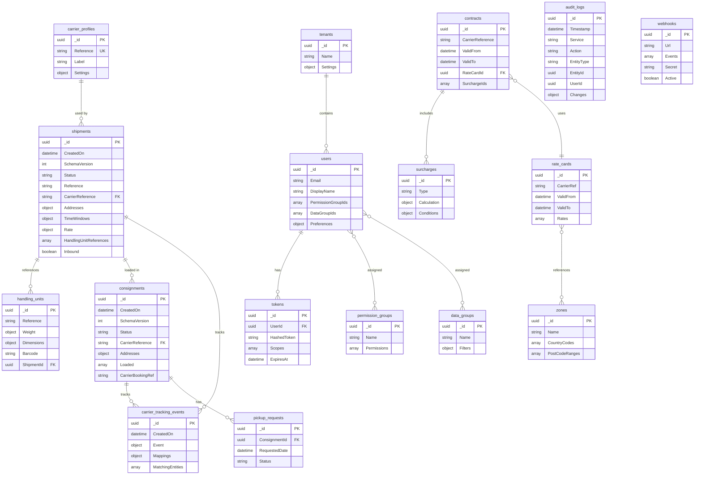

# MongoDB Entity Relationships & Data Model

## Summary

This document maps the MongoDB data structure across all Viya TMS services, documenting entity relationships, data patterns, and cross-service integration points. The system uses a **microservices architecture** where each service owns its database with complete isolation. Services communicate through **synchronous HTTP APIs** for real-time operations and **asynchronous events** (AWS SNS/SQS) for eventual consistency - never through direct database access.

Key architectural decisions:
1. **Database-per-service** - No shared databases between services
2. **Synchronous HTTP APIs** - Real-time cross-service calls (e.g., shipping → rates for pricing)
3. **Event-driven integration** - Async events for eventual consistency (e.g., ShipmentCreated → hooks, auditor)
4. **Embedded vs Referenced** - Strategic mix based on query patterns
5. **Database-per-tenant** - Multi-tenancy via separate databases, not document-level filtering

## Database Overview

| Database | Service | Primary Purpose |
|----------|---------|-----------------|
| `shipping` | shipping | Core logistics: shipments, consignments, tracking |
| `authorizing` | authorizing | Identity: users, tokens, permissions |
| `rates` | rates | Pricing: contracts, surcharges, zones |
| `auditor` | auditor | Audit trail and compliance |
| `hooks` | hooks | Webhooks and scheduled jobs |
| `printing` | printing | Label printing integration |
| `ftp` | ftp | File transfer configurations |

---

## 1. SHIPPING Database (Core Domain)

The largest and most complex database, containing the core logistics entities.

### Collections Overview

| Collection | Purpose | Approx Size |
|------------|---------|-------------|
| `shipments` | Individual shipment requests | Primary |
| `consignments` | Carrier bookings (1+ shipments) | Primary |
| `handling_units` | Physical packages/parcels | Primary |
| `carrier_tracking_events` | Status updates from carriers | High volume |
| `events` | Internal event sourcing log | High volume |
| `carrier_profiles` | Carrier configuration | Reference |
| `invoices` | Carrier invoices | Transactional |
| `pickup_requests` | Scheduled pickups | Transactional |
| `mv_*` / `analytics_*` | Materialized views | Derived |

### Entity Relationship Diagram (Shipping)

```
┌─────────────────────────────────────────────────────────────────────────────┐
│                           SHIPPING DATABASE                                  │
├─────────────────────────────────────────────────────────────────────────────┤
│                                                                              │
│  ┌──────────────────┐         ┌──────────────────┐                          │
│  │  carrier_profiles │         │  service_levels  │                          │
│  │──────────────────│         │──────────────────│                          │
│  │ _id              │         │ _id              │                          │
│  │ Reference ●──────┼────┐    │ Reference ●──────┼────┐                     │
│  │ Label            │    │    │ CarrierRef       │    │                     │
│  │ Settings         │    │    │ TransitDays      │    │                     │
│  └──────────────────┘    │    └──────────────────┘    │                     │
│                          │                            │                     │
│                          │ 1:N                        │ 1:N                 │
│                          ▼                            ▼                     │
│  ┌─────────────────────────────────────────────────────────────────────┐   │
│  │                           shipments                                   │   │
│  │─────────────────────────────────────────────────────────────────────│   │
│  │ _id: UUID                                                            │   │
│  │ CreatedOn: ISODate                        ┌─────────────────────────┐│   │
│  │ SchemaVersion: int                        │ EMBEDDED: Addresses     ││   │
│  │ Data: {                                   │  ├─ Sender {}           ││   │
│  │   Status: enum ───────────────────────────│  ├─ Receiver {}         ││   │
│  │   Reference: string                       │  └─ Collection {}       ││   │
│  │   CarrierReference: string ◄──────────────┼─────────────────────────┘│   │
│  │   CarrierLabel: string                    │                          │   │
│  │   ServiceLevelReference: string           │ EMBEDDED: TimeWindows    │   │
│  │   Addresses: { ... } ◄────────────────────│  ├─ Pickup.Planned/Req  │   │
│  │   TimeWindows: { ... }                    │  └─ Delivery.Planned/Req│   │
│  │   Rate: { ... } ◄─────────────────────────┼───────────────────────┐ │   │
│  │   HandlingUnitReferences: [UUID] ●────────┼──┐ EMBEDDED: Rate     │ │   │
│  │   Inbound: boolean                        │  │  ├─ Price.Total    │ │   │
│  │ }                                         │  │  └─ Weights.Billable│ │   │
│  └───────────────────────────────────────────┼──┼────────────────────┘ │   │
│                          │                   │  │                      │   │
│                          │ 1:N               │  │ N:1 (by ref)         │   │
│                          ▼                   │  ▼                      │   │
│  ┌──────────────────────────────────────┐    │  ┌───────────────────┐  │   │
│  │          consignments                 │    │  │  handling_units    │  │   │
│  │──────────────────────────────────────│    │  │───────────────────│  │   │
│  │ _id: UUID                            │    │  │ _id: UUID         │  │   │
│  │ CreatedOn                            │    │  │ Reference         │  │   │
│  │ SchemaVersion                        │    │  │ Weight            │  │   │
│  │ Data: {                              │    │  │ Dimensions: {     │  │   │
│  │   Status: enum                       │    │  │   Length, Width,  │  │   │
│  │   CarrierReference                   │    └──│   Height          │  │   │
│  │   Addresses: { Sender, Receiver }    │       │ }                 │  │   │
│  │   Loaded: [ ◄────────────────────────┤       │ Barcode           │  │   │
│  │     {                                │       │ ShipmentId ●──────│──►   │
│  │       ShipmentId: UUID ●─────────────┼───►   └───────────────────┘  │   │
│  │       ShipmentReference              │                              │   │
│  │       HandlingUnits: [ embedded ]    │                              │   │
│  │     }                                │                              │   │
│  │   ]                                  │                              │   │
│  │   CarrierBookingRef                  │                              │   │
│  │ }                                    │                              │   │
│  └──────────────────────────────────────┘                              │   │
│                          │                                             │   │
│                          │ 1:N (via MatchingEntities)                  │   │
│                          ▼                                             │   │
│  ┌──────────────────────────────────────┐      ┌────────────────────┐  │   │
│  │      carrier_tracking_events          │      │  pickup_requests   │  │   │
│  │──────────────────────────────────────│      │────────────────────│  │   │
│  │ _id: UUID                            │      │ _id: UUID          │  │   │
│  │ CreatedOn                            │      │ ConsignmentId ●────┼──┼──►│
│  │ Data: {                              │      │ RequestedDate      │  │   │
│  │   Event: {                           │      │ Status             │  │   │
│  │     EventDateTime                    │      │ CarrierResponse    │  │   │
│  │     EventType: { Code, Desc }        │      └────────────────────┘  │   │
│  │     Reason: { Code }                 │                              │   │
│  │   }                                  │      ┌────────────────────┐  │   │
│  │   Mappings.StandardizedCode          │      │     invoices       │  │   │
│  │   MatchingEntities: [                │      │────────────────────│  │   │
│  │     { LogisticsUnitType, _id } ●─────┼──►   │ _id: UUID          │  │   │
│  │   ]                                  │      │ CarrierReference   │  │   │
│  │ }                                    │      │ InvoiceLines: []   │  │   │
│  └──────────────────────────────────────┘      └────────────────────┘  │   │
│                                                                        │   │
│  ┌──────────────────────────────────────┐                              │   │
│  │              events                   │                              │   │
│  │──────────────────────────────────────│ INTERNAL EVENT STORE         │   │
│  │ _id: UUID                            │ (Event Sourcing)             │   │
│  │ Type: string                         │                              │   │
│  │ EntityId: UUID                       │                              │   │
│  │ Timestamp: ISODate                   │                              │   │
│  │ Payload: { ... }                     │                              │   │
│  └──────────────────────────────────────┘                              │   │
│                                                                        │   │
└────────────────────────────────────────────────────────────────────────────┘

LEGEND:
  ●────►  Reference (by ID)
  ◄────   Embedded document
  1:N     One-to-many relationship
```

### Key Relationships (Shipping)

| From | To | Type | Field | Description |
|------|-----|------|-------|-------------|
| `shipments` | `handling_units` | 1:N Reference | `HandlingUnitReferences[]` | Array of UUIDs |
| `shipments` | `carrier_profiles` | N:1 Reference | `CarrierReference` | String lookup key |
| `consignments` | `shipments` | N:N Embedded | `Loaded[].ShipmentId` | Shipment embedded in consignment |
| `carrier_tracking_events` | `shipments/consignments` | N:1 Reference | `MatchingEntities[]._id` | Polymorphic reference |
| `pickup_requests` | `consignments` | N:1 Reference | `ConsignmentId` | Direct UUID reference |

### Document Schemas (Shipping)

#### Shipment Document
```javascript
{
  _id: "550e8400-e29b-41d4-a716-446655440000",
  CreatedOn: ISODate("2026-01-20T10:30:00Z"),
  SchemaVersion: 1,
  Data: {
    Status: "Confirmed",              // Created | Ordered | Confirmed | Delivered
    Reference: "REF-2026-00123",
    CarrierReference: "DHLPX",        // FK to carrier_profiles.Reference
    CarrierLabel: "DHL Parcel",
    ServiceLevelReference: "DFY-B2C",
    
    // EMBEDDED: Full address documents
    Addresses: {
      Sender: {
        CompanyName: "Acme Corp",
        ContactName: "John Doe",
        Street: "Hoofdweg 123",
        City: "Amsterdam",
        PostCode: "1012AB",
        CountryCode: "NL",
        Phone: "+31612345678",
        Email: "john@acme.com"
      },
      Receiver: { /* same structure */ },
      Collection: { /* same structure, optional */ }
    },
    
    // EMBEDDED: Time windows for SLA tracking
    TimeWindows: {
      Pickup: {
        Planned: { Start: ISODate, End: ISODate },
        Requested: { Start: ISODate, End: ISODate }
      },
      Delivery: {
        Planned: { Start: ISODate, End: ISODate },
        Requested: { Start: ISODate, End: ISODate }
      }
    },
    
    // EMBEDDED: Pricing info
    Rate: {
      Price: {
        TotalRequestedCurrency: { Value: 15.50, CurrencyCode: "EUR" }
      },
      Weights: {
        BillableWeight: { Value: 2.5, Unit: "kg" },
        PhysicalWeight: { Value: 2.3, Unit: "kg" }
      }
    },
    
    // REFERENCES: Array of handling unit IDs
    HandlingUnitReferences: [
      "660e8400-e29b-41d4-a716-446655440001",
      "660e8400-e29b-41d4-a716-446655440002"
    ],
    
    Inbound: false
  }
}
```

#### Consignment Document
```javascript
{
  _id: "770e8400-e29b-41d4-a716-446655440000",
  CreatedOn: ISODate("2026-01-20T10:35:00Z"),
  SchemaVersion: 1,
  Data: {
    Status: "Ordered",
    CarrierReference: "DHLPX",
    CarrierBookingReference: "1Z999AA10123456784",
    
    Addresses: {
      Sender: { /* embedded */ },
      Receiver: { /* embedded */ }
    },
    
    // EMBEDDED: Shipment summaries with handling units
    Loaded: [
      {
        ShipmentId: "550e8400-e29b-41d4-a716-446655440000",
        ShipmentReference: "REF-2026-00123",
        HandlingUnits: [
          {
            _id: "660e8400-e29b-41d4-a716-446655440001",
            Reference: "PKG-001",
            Weight: { Value: 1.5, Unit: "kg" },
            Length: 30,
            Width: 20,
            Height: 15
          }
        ]
      }
    ]
  }
}
```

#### Carrier Tracking Event
```javascript
{
  _id: "880e8400-e29b-41d4-a716-446655440000",
  CreatedOn: ISODate("2026-01-20T14:22:00Z"),
  Data: {
    Event: {
      EventDateTime: { DateTime: ISODate("2026-01-20T14:20:00Z") },
      EventType: { Code: "Delivered", Description: "Package delivered" },
      Reason: { Code: "Completed" }
    },
    
    // Standardized code mapping
    Mappings: {
      StandardizedCode: {
        Result: {
          Value: {
            Name: "Delivered",
            Value: { Process: "Delivery", State: "Completed" }
          }
        }
      }
    },
    
    // Polymorphic reference to shipment OR consignment
    MatchingEntities: [
      { LogisticsUnitType: "Shipment", _id: "550e8400..." },
      { LogisticsUnitType: "Consignment", _id: "770e8400..." }
    ]
  }
}
```

---

## 2. AUTHORIZING Database

Manages identity, access control, and API tokens.

### Collections

| Collection | Purpose |
|------------|---------|
| `users` | User profiles and preferences |
| `tokens` | API tokens (hashed) |
| `permission_groups` | Role definitions |
| `data_groups` | Row-level security filters |
| `tenants` | Tenant configuration |

### Entity Relationships (Authorizing)

```
┌─────────────────────────────────────────────────────────────────┐
│                      AUTHORIZING DATABASE                        │
├─────────────────────────────────────────────────────────────────┤
│                                                                  │
│  ┌───────────────────┐       ┌───────────────────┐              │
│  │      tenants       │       │ permission_groups │              │
│  │───────────────────│       │───────────────────│              │
│  │ _id               │       │ _id               │              │
│  │ Name              │       │ Name              │              │
│  │ Settings          │       │ Permissions: []   │              │
│  └─────────┬─────────┘       └─────────┬─────────┘              │
│            │ 1:N                       │ N:N                    │
│            ▼                           ▼                        │
│  ┌─────────────────────────────────────────────────────────┐   │
│  │                        users                              │   │
│  │─────────────────────────────────────────────────────────│   │
│  │ _id: UUID                                                │   │
│  │ Email: string                                            │   │
│  │ DisplayName: string                                      │   │
│  │ PermissionGroupIds: [UUID] ●─────────────────────────►  │   │
│  │ DataGroupIds: [UUID] ●───────────────────────────────►  │   │
│  │ Preferences: { embedded }                                │   │
│  └─────────────────────────────────────────────────────────┘   │
│            ▲                           ▲                        │
│            │ N:N                       │ N:N                    │
│            │                           │                        │
│  ┌─────────┴─────────┐       ┌─────────┴─────────┐              │
│  │      tokens        │       │   data_groups     │              │
│  │───────────────────│       │───────────────────│              │
│  │ _id               │       │ _id               │              │
│  │ UserId ●──────────│──►    │ Name              │              │
│  │ HashedToken       │       │ Filters: {        │              │
│  │ Scopes: []        │       │   CustomerIds     │              │
│  │ ExpiresAt         │       │   CarrierRefs     │              │
│  └───────────────────┘       │ }                 │              │
│                              └───────────────────┘              │
│                                                                  │
└─────────────────────────────────────────────────────────────────┘
```

---

## 3. RATES Database

Manages carrier contracts, pricing rules, and zone definitions.

### Collections

| Collection | Purpose |
|------------|---------|
| `contracts` | Carrier pricing agreements |
| `surcharges` | Additional fees (fuel, residential, etc.) |
| `zones` | Geographic zone definitions |
| `service_levels` | Service offerings per carrier |
| `rate_cards` | Pricing tables |

### Entity Relationships (Rates)

```
┌─────────────────────────────────────────────────────────────────┐
│                         RATES DATABASE                           │
├─────────────────────────────────────────────────────────────────┤
│                                                                  │
│  ┌───────────────────┐       ┌───────────────────┐              │
│  │    rate_cards      │       │      zones        │              │
│  │───────────────────│       │───────────────────│              │
│  │ _id               │       │ _id               │              │
│  │ CarrierRef        │       │ Name              │              │
│  │ ValidFrom/To      │       │ CountryCodes: []  │              │
│  │ Rates: [          │       │ PostCodeRanges: []│              │
│  │   { Zone, Weight, │       └─────────┬─────────┘              │
│  │     Price }       │                 │ N:1                    │
│  │ ]                 │                 │                        │
│  └─────────┬─────────┘                 │                        │
│            │ N:1                       │                        │
│            ▼                           ▼                        │
│  ┌─────────────────────────────────────────────────────────┐   │
│  │                      contracts                            │   │
│  │─────────────────────────────────────────────────────────│   │
│  │ _id: UUID                                                │   │
│  │ CarrierReference ●──────────────────────────────────►   │   │
│  │ ValidFrom: ISODate                                       │   │
│  │ ValidTo: ISODate                                         │   │
│  │ RateCardId ●────────────────────────────────────────►   │   │
│  │ SurchargeIds: [UUID] ●──────────────────────────────►   │   │
│  │ CustomRules: { embedded }                                │   │
│  └─────────────────────────────────────────────────────────┘   │
│                                       │                         │
│                                       │ 1:N                     │
│                                       ▼                         │
│  ┌─────────────────────────────────────────────────────────┐   │
│  │                     surcharges                            │   │
│  │─────────────────────────────────────────────────────────│   │
│  │ _id: UUID                                                │   │
│  │ Type: enum (Fuel, Residential, Oversize, ...)           │   │
│  │ Calculation: { Method, Value, Unit }                     │   │
│  │ Conditions: { embedded rules }                           │   │
│  └─────────────────────────────────────────────────────────┘   │
│                                                                  │
└─────────────────────────────────────────────────────────────────┘
```

---

## 4. Other Databases

### AUDITOR Database

```
┌──────────────────────────────────┐
│        AUDITOR DATABASE          │
├──────────────────────────────────┤
│  ┌───────────────────────────┐  │
│  │       audit_logs           │  │
│  │───────────────────────────│  │
│  │ _id                       │  │
│  │ Timestamp                 │  │
│  │ Service: string           │  │  ◄── All services publish here
│  │ Action: string            │  │
│  │ EntityType: string        │  │
│  │ EntityId: UUID            │  │
│  │ UserId: UUID              │  │
│  │ Changes: { before, after }│  │
│  └───────────────────────────┘  │
└──────────────────────────────────┘
```

### HOOKS Database

```
┌──────────────────────────────────┐
│         HOOKS DATABASE           │
├──────────────────────────────────┤
│  ┌───────────────────────────┐  │
│  │        webhooks            │  │
│  │───────────────────────────│  │
│  │ _id                       │  │
│  │ Url: string               │  │
│  │ Events: []                │  │  ◄── ShipmentCreated, etc.
│  │ Secret: string            │  │
│  │ Active: boolean           │  │
│  └───────────────────────────┘  │
│                                  │
│  ┌───────────────────────────┐  │
│  │     scheduled_jobs         │  │
│  │───────────────────────────│  │
│  │ _id                       │  │
│  │ CronExpression            │  │
│  │ Action: { ... }           │  │
│  │ LastRun / NextRun         │  │
│  └───────────────────────────┘  │
└──────────────────────────────────┘
```

### PRINTING Database

```
┌──────────────────────────────────┐
│       PRINTING DATABASE          │
├──────────────────────────────────┤
│  ┌───────────────────────────┐  │
│  │        printers            │  │
│  │───────────────────────────│  │
│  │ _id                       │  │
│  │ PrintNodeId               │  │  ◄── External PrintNode ID
│  │ Name                      │  │
│  │ DefaultFor: []            │  │
│  └───────────────────────────┘  │
│                                  │
│  ┌───────────────────────────┐  │
│  │       print_jobs           │  │
│  │───────────────────────────│  │
│  │ _id                       │  │
│  │ PrinterId ●───────────────│──►
│  │ ShipmentId ●──────────────│──►  (cross-DB ref)
│  │ Status                    │  │
│  │ DocumentUrl               │  │
│  └───────────────────────────┘  │
└──────────────────────────────────┘
```

---

## Cross-Service Relationships

Services do NOT directly access each other's databases. Instead, they communicate via:

1. **Synchronous HTTP APIs** - For real-time operations
2. **Asynchronous Events (SNS/SQS)** - For eventual consistency
3. **ID References** - Storing external IDs for later API calls

### Cross-Service Data Flow

```
┌─────────────────────────────────────────────────────────────────────────────┐
│                        CROSS-SERVICE DATA FLOW                               │
├─────────────────────────────────────────────────────────────────────────────┤
│                                                                              │
│  ┌─────────────┐                    ┌─────────────┐                         │
│  │  shipping   │ ──HTTP──────────► │    rates    │                          │
│  │             │  "Get rate for    │             │                          │
│  │ (shipments) │   this shipment"  │ (contracts) │                          │
│  └──────┬──────┘                    └─────────────┘                         │
│         │                                                                    │
│         │ SNS Event:                                                         │
│         │ ShipmentCreated                                                    │
│         ▼                                                                    │
│  ┌─────────────────────────────────────────────────────────────────────┐   │
│  │                         AWS SNS/SQS                                   │   │
│  └────┬───────────────┬────────────────────┬────────────────────┬──────┘   │
│       │               │                    │                    │           │
│       ▼               ▼                    ▼                    ▼           │
│  ┌─────────┐    ┌─────────┐          ┌─────────┐          ┌─────────┐      │
│  │  hooks  │    │ auditor │          │printing │          │   ftp   │      │
│  │         │    │         │          │         │          │         │      │
│  │ Sends   │    │ Stores  │          │ Queues  │          │ Uploads │      │
│  │ webhook │    │ audit   │          │ print   │          │ to SFTP │      │
│  │ to 3rd  │    │ log     │          │ job     │          │         │      │
│  │ parties │    │         │          │         │          │         │      │
│  └─────────┘    └─────────┘          └─────────┘          └─────────┘      │
│                                                                              │
└─────────────────────────────────────────────────────────────────────────────┘

IMPORTANT: No direct database access between services!
           All cross-service data flows through APIs or events.
```

### ID References Across Services

| Service A | Service B | Reference Type | Notes |
|-----------|-----------|----------------|-------|
| shipping | authorizing | `UserId` | User context from JWT |
| shipping | rates | `CarrierReference`, `ServiceLevelReference` | String keys |
| printing | shipping | `ShipmentId` | Store for later API call |
| hooks | shipping | `ShipmentId` | Fetch data for webhook payload |
| auditor | all | `EntityId`, `EntityType` | Polymorphic reference |

---

## Entity Relationship Diagram (Mermaid)



---

## Data Patterns & Best Practices

### 1. Embedded vs Referenced

| Pattern | When to Use | Example |
|---------|-------------|---------|
| **Embed** | Data always accessed together, bounded size | Addresses in shipments |
| **Reference** | Data accessed independently, unbounded | HandlingUnits from Shipments |
| **Hybrid** | Summary embedded, details referenced | Consignments embed shipment summary |

### 2. Multi-Tenancy

Viya uses **database-per-tenant isolation** rather than document-level tenant filtering:

```
┌─────────────────────────────────────────────────────────────┐
│                    MongoDB Cluster                           │
├─────────────────────────────────────────────────────────────┤
│  ┌─────────────────┐  ┌─────────────────┐  ┌─────────────┐ │
│  │ shipping_acme   │  │ shipping_globex │  │ shipping_... │ │
│  │ (Tenant: Acme)  │  │ (Tenant: Globex)│  │             │ │
│  └─────────────────┘  └─────────────────┘  └─────────────┘ │
│  ┌─────────────────┐  ┌─────────────────┐                  │
│  │ rates_acme      │  │ rates_globex    │  ...             │
│  └─────────────────┘  └─────────────────┘                  │
└─────────────────────────────────────────────────────────────┘
```

**Key characteristics:**
- Each tenant has their own set of databases (one per service)
- No `TenantId` field exists in documents - isolation is at the database level
- Service instances connect to tenant-specific databases via configuration
- Queries do not need tenant filters - the connection itself determines the tenant

This approach provides:
- **Strong isolation** - No risk of cross-tenant data leakage
- **Simpler queries** - No need to remember TenantId filters
- **Independent scaling** - Large tenants can have dedicated resources
- **Easier compliance** - Data residency requirements per tenant

### 3. Soft References (String Keys)

Carrier and service level references use **string keys** rather than ObjectIds:
```javascript
// Good: String reference (readable, portable)
{ CarrierReference: "DHLPX" }

// Not used: ObjectId reference (opaque)
{ CarrierId: ObjectId("...") }
```

This allows lookups across services without direct database access.

### 4. Polymorphic References

`carrier_tracking_events` uses polymorphic references to link to different entity types:
```javascript
MatchingEntities: [
  { LogisticsUnitType: "Shipment", _id: "uuid-1" },
  { LogisticsUnitType: "Consignment", _id: "uuid-2" }
]
```

---

## Sources

| # | Source | Contribution |
|---|--------|--------------|
| 1 | [Service Architecture](../shipitsmarter-repos/2026-01-19-service-architecture.md) | Service topology, database mapping |
| 2 | [Reporting Materialized Views](../viya-reporting/2026-01-20-reporting-materialized-views.md) | Shipping DB schema details |
| 3 | Viya MongoDB shipping database | Live schema inspection |

---

## Open Questions

- [ ] Document FTP database collections in detail
- [ ] Map all event types and their payloads
- [ ] Document index strategies per collection
- [ ] Add collection size estimates for production
